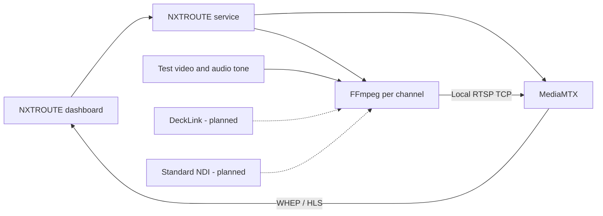

# NXTROUTE Windows architecture

Decision updated on October 7, 2026: native Windows, as requested by the user. This explicitly replaces the Docker/Ubuntu VM plan. Linux containers can use hardware exposed by their host, but capture-card passthrough from this workstation into a VM has not been verified.

## Components

- `NXTROUTE.exe`: ASP.NET Core application on .NET 8, published self-contained for Windows x64. The same executable runs in the foreground or as a Windows service.
- MediaMTX 1.21.1: independent routing and protocol process. NXTROUTE does not reimplement RTSP, RTMP, SRT, HLS, WebRTC or WHEP.
- FFmpeg: one process per synthetic channel, supervised for exit, restart and shutdown. A channel crash does not restart other channels.
- Original dashboard embedded in the executable: channel list, real MediaMTX API status, test-channel creation, start/stop, logs and playback. This version embeds the existing MediaMTX player inside the dashboard.
- DeckLink and NDI: separate adapters, **planned**, not implemented. NDI will use the standard SDK. Installing all NDI Tools is not automatically required.

## Channels and codecs

One logical channel produces two renditions of the same generator: `ID/webrtc` (H.264 baseline, no B-frames, stereo Opus at 48 kHz) and `ID/hls` (H.264 baseline, stereo AAC at 48 kHz). Video is 1280x720 at 25 fps, GOP 25, requested bitrate 2 Mbit/s per rendition. This does not assume universal AAC support in WebRTC or universal Opus support in HLS players. The initial demo uses two video encodes for simplicity; encoder reuse is a later optimization.

MediaMTX only allows the synthetic-channel namespace. Channel identifiers are server-generated. The eight-channel maximum is a demo limit, not a demonstrated hardware capacity. RTMP and SRT listeners exist locally but are not configurable inputs in the UI and have not been tested.

## Persistence, processes and networking

JSON configuration is saved using a temporary file and rename. Service data lives in `%ProgramData%\NXTROUTE`; foreground data uses `%LocalAppData%\NXTROUTE` or an explicit `--data-dir`. MediaMTX configuration is generated by the gateway and should not be edited manually during execution.

Failed processes retry every five seconds. Child processes are attached to Windows Job Objects with `KILL_ON_JOB_CLOSE`; an unexpected gateway exit must not leave orphaned encoders. This is covered by the integration test. On requested shutdown, FFmpeg receives `q`, followed by a wait of up to four seconds and process-tree termination if necessary. Windowless MediaMTX is terminated after the same wait: **a Windows console signal for cooperative MediaMTX shutdown has not been implemented**. The demo does not record video files.

Each component has timestamped logs, rotating at approximately 5 MB with one previous copy. The UI shows the last 60 lines with a maximum read of 32 KB. If the API is unreachable, status is unknown. A live process alone does not make a channel on air: both renditions must be ready.

All listeners use loopback: dashboard 3000 TCP, MediaMTX API 9997 TCP, RTSP 8554 TCP, RTMP 1935 TCP, HLS 8888 TCP, WHEP 8889 TCP, WebRTC media 8189 UDP and SRT 8890 UDP. This version makes no firewall changes and exposes nothing to the LAN. Dashboard mutations check `Origin`; the Host header accepts only localhost and 127.0.0.1. This does not protect against other local programs or users. Authentication and TLS are required before enabling LAN access.

## Installer

Inno Setup generates `NXTROUTE-Setup-0.1.0.exe` with separately licensed components and a bundled .NET runtime. The service uses NetworkService; shortcuts open the dashboard. Service installation/removal and ProgramData permissions require administrator privileges and have not been applied automatically to the workstation. The initial demo does not install Blackmagic or NDI components. Guided prerequisite installation depends on reviewing vendor terms.

Sources: [MediaMTX](https://mediamtx.org/docs/kickoff/introduction), [installation and versions](https://mediamtx.org/docs/kickoff/install), [browser players](https://mediamtx.org/docs/read/web-browsers), [.NET Windows services](https://learn.microsoft.com/en-us/dotnet/core/extensions/windows-service), [DeckLink SDK](https://sdk-doc.blackmagicdesign.com/decklink-sdk/).
