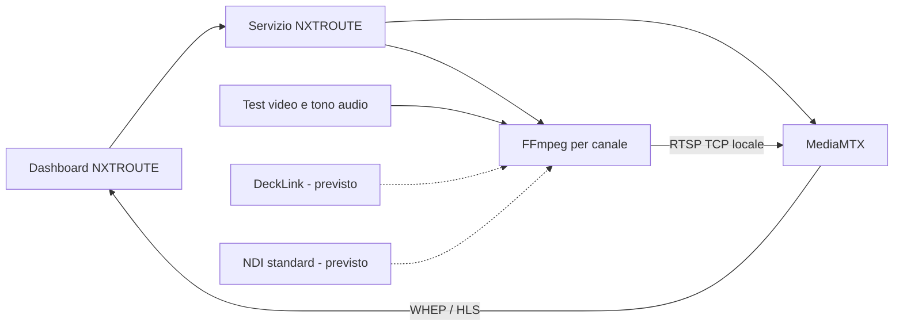

# NXTROUTE: architettura Windows

Decisione aggiornata il 7 ottobre 2026: Windows nativo, in seguito alla richiesta dell'utente. Il piano Docker/VM Ubuntu è stato sostituito esplicitamente. Un container Linux può usare dispositivi hardware esposti dall'host, ma il passthrough della scheda dalla workstation alla VM non è stato verificato.

## Componenti

- `NXTROUTE.exe`: applicazione ASP.NET Core .NET 8, pubblicata self-contained per Windows x64. Lo stesso eseguibile funziona in primo piano o come servizio Windows.
- MediaMTX 1.21.1: processo indipendente per routing e protocolli. Nessuna implementazione originale di RTSP, RTMP, SRT, HLS, WebRTC o WHEP.
- FFmpeg: un processo per canale sintetico. Il gestore controlla uscita, riavvio e arresto. Un crash del canale non riavvia gli altri canali.
- Dashboard originale incorporata nell'eseguibile: elenco canali, stato reale API MediaMTX, creazione test, avvio/arresto, log e player. Per questa prima versione il player è quello già fornito da MediaMTX, incorporato nella dashboard.
- DeckLink e NDI: adattatori separati, **previsti**, non ancora implementati. NDI userà lo SDK standard. Gli NDI Tools non sono un requisito automatico.

## Canali e codec

Un canale logico produce due rendition dello stesso generatore: `ID/webrtc` (H.264 baseline, nessun B-frame, Opus stereo 48 kHz) e `ID/hls` (H.264 baseline, AAC stereo 48 kHz). Video 1280x720 a 25 fps, GOP 25, bitrate richiesto 2 Mbit/s per rendition. Questa scelta non presume la compatibilità universale di AAC su WebRTC o di Opus su ogni player HLS. La prima demo usa due codifiche video per semplicità: ottimizzare il riuso dell'encoder è un lavoro successivo.

MediaMTX permette soltanto il namespace dei canali sintetici; i canali ricevono identificatori generati dal server. Un massimo di 8 canali è un limite della demo, non una capacità hardware dimostrata. RTMP e SRT sono listener locali del router, ma non sono ancora ingressi configurabili nella UI e non sono stati collaudati.

## Persistenza, processi e rete

Configurazione JSON salvata tramite file temporaneo e rename. Per il servizio, dati in `%ProgramData%\NXTROUTE`; in modalità portabile, `%LocalAppData%\NXTROUTE` o directory esplicita `--data-dir`. Il file MediaMTX è generato dal gateway e non va modificato a mano durante l'esecuzione.

Retry dei processi falliti ogni 5 secondi. I processi figli sono associati a Windows Job Objects con `KILL_ON_JOB_CLOSE`: un arresto inatteso del gateway non deve lasciare encoder orfani. Il test verifica questa proprietà. Arresto richiesto: FFmpeg riceve `q`, attesa fino a 4 secondi, poi terminazione dell'albero. MediaMTX senza finestra viene terminato dopo la stessa attesa: **non è ancora implementato un segnale console Windows per il suo arresto cooperativo**. La demo non registra file video.

Log timestampati per componente, rotazione a circa 5 MB e una copia precedente. L'interfaccia mostra le ultime 60 righe, limitando la lettura a 32 KB. Quando l'API non risponde lo stato è sconosciuto, mai un falso verde. Un processo vivo non basta a dichiarare un canale in onda: devono essere pronte entrambe le rendition.

Tutti i listener sono su loopback: dashboard 3000 TCP, MediaMTX API 9997 TCP, RTSP 8554 TCP, RTMP 1935 TCP, HLS 8888 TCP, WHEP 8889 TCP, WebRTC media 8189 UDP, SRT 8890 UDP. Nessuna modifica al firewall e nessuna esposizione alla LAN in questa versione. Le mutazioni della dashboard controllano `Origin`; l'header Host accetta soltanto localhost e 127.0.0.1. Non è una barriera contro altri programmi o utenti locali: autenticazione e TLS sono criteri obbligatori prima dell'accesso LAN.

## Installer

Inno Setup produce `NXTROUTE-Setup-0.1.0.exe`, con componenti redistribuibili esterni e .NET incluso. Il servizio usa NetworkService e i collegamenti aprono la dashboard. Installazione/disinstallazione del servizio e permessi ProgramData richiedono amministratore: non sono stati applicati automaticamente alla workstation. Driver Blackmagic e NDI non vengono installati nella prima demo; il flusso guidato dipenderà dall'esame delle licenze vendor.

Fonti: [MediaMTX](https://mediamtx.org/docs/kickoff/introduction), [installazione e versioni](https://mediamtx.org/docs/kickoff/install), [player browser](https://mediamtx.org/docs/read/web-browsers), [servizi .NET](https://learn.microsoft.com/en-us/dotnet/core/extensions/windows-service), [DeckLink SDK](https://sdk-doc.blackmagicdesign.com/decklink-sdk/).
